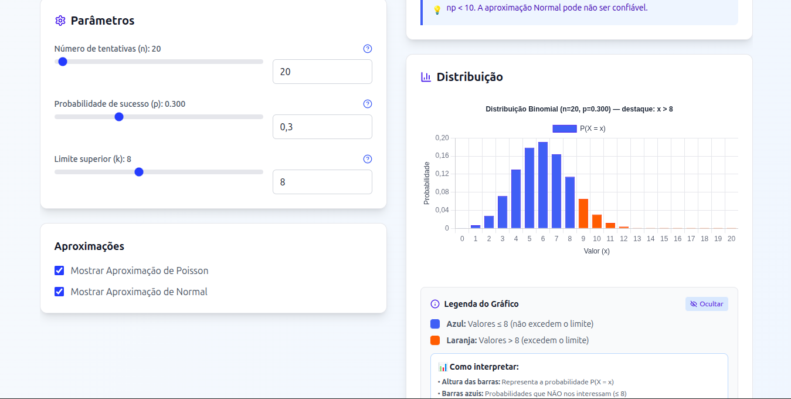
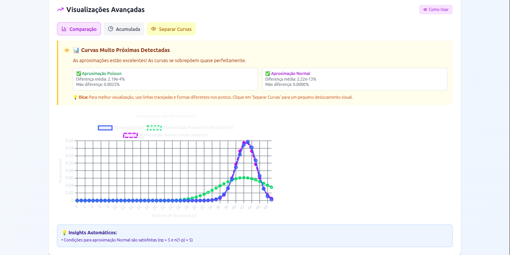

# Calculadora de Probabilidade Binomial

[](https://reactjs.org/)
[](https://www.typescriptlang.org/)
[](https://vitejs.dev/)
[](https://tailwindcss.com/)
[](https://www.chartjs.org/)

Uma aplicação web educacional para cálculo de probabilidades binomiais, desenvolvida com tecnologias modernas. A ferramenta oferece cálculos precisos, aproximações estatísticas, visualizações interativas e conteúdo educacional completo para o aprendizado de distribuições de probabilidade.

## Demonstração Online

**Acesse:** [https://jonhvito.github.io/Binomial/](https://jonhvito.github.io/Binomial/)

## Capturas de Tela

### Interface Principal


### Funcionalidades Principais


### Tutorial e Recursos Educacionais


### Visualizações Avançadas


## Finalidade da Aplicação

Esta calculadora foi desenvolvida com o objetivo de facilitar o ensino e aprendizado de distribuições de probabilidade binomial. A ferramenta serve para:

- **Educação Estatística**: Ensinar conceitos de probabilidade de forma visual e interativa
- **Análise de Dados**: Calcular probabilidades em cenários práticos de diferentes áreas
- **Comparação de Métodos**: Demonstrar diferenças entre cálculos exatos e aproximações
- **Validação de Resultados**: Verificar cálculos manuais com precisão computacional

## Funcionalidades

### Cálculos Probabilísticos
- **Cálculo Exato Binomial**: Implementação precisa da fórmula binomial usando algoritmos otimizados
- **Aproximação Poisson**: Para cenários com grandes amostras e eventos raros (λ = n×p pequeno)
- **Aproximação Normal**: Para amostras grandes com correção de continuidade adequada
- **Análise Comparativa**: Comparação automática entre métodos com cálculo de erros relativos
- **Validação Inteligente**: Sistema que indica qual aproximação é mais adequada para cada cenário

### Visualizações Interativas
- **Gráfico de Distribuição**: Histograma interativo da distribuição binomial
- **Visualizações Comparativas**: Sobreposição de distribuições exata e aproximadas
- **Destaque Visual**: Diferenciação clara entre P(X > k) e P(X ≤ k) através de cores
- **Tooltips Informativos**: Valores precisos exibidos ao interagir com os gráficos
- **Interface Responsiva**: Adaptação automática para diferentes tamanhos de tela

### Conteúdo Educacional
- **Tutorial Interativo**: Guia passo-a-passo através de todas as funcionalidades
- **Glossário Completo**: Definições detalhadas de termos estatísticos com fórmulas
- **Explicação Detalhada**: Interpretação contextualizada dos resultados obtidos
- **Modais Explicativos**: Conteúdo educacional sobre parâmetros e conceitos
- **Dicas Inteligentes**: Sugestões contextuais baseadas nos parâmetros inseridos

### Cenários Práticos
A aplicação inclui nove cenários pré-configurados baseados em situações reais:
- **Controle de Qualidade**: Análise de peças defeituosas em produção industrial
- **Medicina**: Probabilidade de casos positivos em testes diagnósticos
- **Esportes**: Performance em arremessos livres e chutes a gol
- **Tecnologia**: Detecção de bugs em código de software
- **Aviação**: Análise de pontualidade em voos comerciais
- **Educação**: Taxa de aprovação em exames acadêmicos
- **Estatística**: Eventos raros em grandes amostras

### Interface e Usabilidade
- **Controles Intuitivos**: Sliders sincronizados com campos de entrada numérica
- **Validação em Tempo Real**: Feedback imediato sobre a validade dos parâmetros
- **Tema Adaptável**: Alternância entre modos claro e escuro
- **Design Responsivo**: Funcionalidade completa em dispositivos móveis e desktop
- **Performance Otimizada**: Cálculos eficientes mesmo para valores extremos

## Como Usar a Aplicação

### Instalação Local

### Pré-requisitos
- Node.js versão 18 ou superior
- npm ou yarn

### Passos de Instalação

```bash
# Clone o repositório
git clone https://github.com/jonhvito2/Binomial-2.git
cd Binomial-2

# Instale as dependências
npm install

# Execute em modo desenvolvimento
npm run dev

# Construa para produção
npm run build
npm run preview
```

### Parâmetros de Entrada

#### n (Número de tentativas)
- **Definição**: Total de experimentos independentes realizados
- **Faixa**: 1 ≤ n ≤ 100.000
- **Exemplo**: 100 peças produzidas, 50 alunos avaliados

#### p (Probabilidade de sucesso)
- **Definição**: Probabilidade de ocorrer o evento de interesse em cada tentativa
- **Faixa**: 0 ≤ p ≤ 1
- **Exemplo**: 0.02 (2% de defeito), 0.85 (85% de aprovação)

#### k (Limite superior)
- **Definição**: Valor de referência para calcular P(X > k)
- **Faixa**: 0 ≤ k ≤ n
- **Interpretação**: "Mais de k sucessos em n tentativas"

### Interpretação dos Resultados

#### Probabilidade Exata (Binomial)
Valor calculado usando a fórmula binomial precisa. Este é sempre o valor de referência mais confiável.

#### Aproximação Poisson
Utilizada quando n é grande e p é pequeno (λ = n×p < 10). A qualidade da aproximação é indicada automaticamente.

#### Aproximação Normal
Aplicável quando np ≥ 10 e n(1-p) ≥ 10. Inclui correção de continuidade para melhor precisão.

#### Sistema de Validação
- **Recomendado**: Aproximação altamente confiável (ícone verde)
- **Aceitável**: Aproximação utilizável com cautela (ícone amarelo)  
- **Inadequado**: Aproximação não recomendada (ícone vermelho)

## Conceitos Matemáticos

### Distribuição Binomial
A distribuição binomial modela o número de sucessos em n tentativas independentes, onde cada tentativa tem probabilidade p de sucesso.

**Fórmula:**
```
P(X = k) = C(n,k) × p^k × (1-p)^(n-k)
```

**Onde:**
- C(n,k) = n! / (k! × (n-k)!) é o coeficiente binomial
- n = número de tentativas
- k = número de sucessos
- p = probabilidade de sucesso

### Aproximação Poisson
Utilizada quando n é grande e p é pequeno, mantendo λ = n×p relativamente pequeno.

**Fórmula:**
```
P(X = k) ≈ e^(-λ) × λ^k / k!
```

**Condições de aplicabilidade:**
- n grande (n > 50)
- p pequeno (p < 0.1)
- λ = n×p < 10

### Aproximação Normal
Válida para grandes amostras com np ≥ 10 e n(1-p) ≥ 10.

**Parâmetros:**
- Média: μ = n×p
- Variância: σ² = n×p×(1-p)
- Desvio padrão: σ = √[n×p×(1-p)]

**Correção de continuidade:**
```
P(X > k) ≈ P(Z > (k + 0.5 - μ)/σ)
```

## Estrutura do Projeto

### Arquitetura Modular
A aplicação segue uma arquitetura modular para facilitar manutenção e extensibilidade:

```
src/
├── components/
│   ├── ProbabilityCalculator_Enhanced.tsx    # Componente principal
│   ├── ui/
│   │   └── ThemeToggle.tsx                   # Controle de tema
│   └── probability/                          # Componentes modulares
│       ├── ParameterControls.tsx             # Controles de entrada
│       ├── ResultsDisplay.tsx                # Exibição de resultados
│       ├── DistributionChart.tsx             # Gráfico de distribuição
│       ├── BinomialExplainer.tsx            # Explicações educacionais
│       ├── InteractiveTutorial.tsx          # Tutorial interativo
│       ├── Glossary.tsx                     # Glossário de termos
│       └── ...                              # Outros componentes
├── hooks/
│   ├── useProbabilityCalculator.ts          # Lógica principal
│   ├── useTheme.ts                          # Gerenciamento de tema
│   └── ...                                 # Outros hooks
├── utils/
│   ├── probabilityCalculations.ts           # Funções matemáticas
│   ├── validation.ts                        # Validação de entrada
│   ├── presets.ts                           # Cenários pré-definidos
│   └── ...                                 # Outros utilitários
└── contexts/
    └── ThemeContext.tsx                     # Contexto de tema
```

### Separação de Responsabilidades
- **Componentes UI**: Renderização e interação com usuário
- **Hooks**: Lógica de estado e efeitos
- **Utilitários**: Funções matemáticas e validações
- **Contextos**: Estado global da aplicação

## Tecnologias Utilizadas

### Stack Principal
- **React 18**: Framework para interface de usuário com componentes funcionais
- **TypeScript**: Sistema de tipagem estática para maior segurança e manutenibilidade
- **Vite**: Build tool moderno com hot module replacement
- **Tailwind CSS**: Framework CSS utilitário para estilização

### Bibliotecas de Visualização
- **Chart.js**: Biblioteca para criação de gráficos interativos
- **react-chartjs-2**: Integração React para Chart.js
- **KaTeX**: Renderização de fórmulas matemáticas LaTeX

### Interface e Ícones
- **Lucide React**: Conjunto de ícones consistentes e modernos
- **Sistema de Temas**: Implementação completa de modo claro/escuro

### Ferramentas de Desenvolvimento
- **ESLint**: Análise estática de código e detecção de problemas
- **PostCSS**: Processamento avançado de CSS
- **Autoprefixer**: Compatibilidade automática entre navegadores

## Exemplos de Uso

### Controle de Qualidade
```
n = 100    (100 peças produzidas)
p = 0.02   (2% de probabilidade de defeito)
k = 5      (mais de 5 peças defeituosas)

Pergunta: Qual a probabilidade de ter mais de 5 peças defeituosas?
```

### Análise Médica
```
n = 500    (500 testes realizados)
p = 0.002  (0.2% de taxa de infecção)
k = 2      (mais de 2 casos positivos)

Pergunta: Qual a probabilidade de encontrar mais de 2 casos?
```

### Performance Esportiva
```
n = 30     (30 arremessos livres)
p = 0.1    (10% de chance de erro)
k = 5      (mais de 5 erros)

Pergunta: Qual a probabilidade de errar mais de 5 arremessos?
```

## Scripts de Desenvolvimento

```bash
# Desenvolvimento
npm run dev          # Servidor de desenvolvimento com hot reload
npm run build        # Build de produção otimizado
npm run preview      # Visualização local do build de produção
npm run lint         # Verificação de qualidade do código
```

## Contribuição

Este projeto aceita contribuições da comunidade para expandir suas funcionalidades educacionais e melhorar a experiência do usuário.

### Como Contribuir

1. **Fork** o repositório
2. **Clone** sua cópia: `git clone https://github.com/seu-usuario/Binomial-2.git`
3. **Crie** uma branch para sua funcionalidade: `git checkout -b feature/nova-funcionalidade`
4. **Commit** suas mudanças: `git commit -m 'Adiciona nova funcionalidade'`
5. **Push** para sua branch: `git push origin feature/nova-funcionalidade`
6. **Abra** um Pull Request detalhando as mudanças

### Áreas de Melhoria

#### Novos Cenários
- Adicionar exemplos de diferentes áreas do conhecimento
- Criar casos práticos específicos para ensino
- Expandir os cenários pré-definidos

#### Funcionalidades Educacionais
- Melhorar explicações matemáticas
- Adicionar mais conteúdo ao glossário
- Expandir o tutorial interativo

#### Melhorias de Interface
- Otimizar responsividade para tablets
- Melhorar acessibilidade
- Adicionar animações educativas

#### Performance e Algoritmos
- Otimizar cálculos para valores extremos
- Implementar algoritmos alternativos
- Melhorar cache de resultados

### Padrões de Código

- **TypeScript**: Tipagem obrigatória para todas as funções públicas
- **Componentes**: PascalCase para nomes de componentes
- **Funções**: camelCase para funções e variáveis
- **Documentação**: Comentários JSDoc para funções complexas

### Estrutura de Commits
```
feat: adiciona novo cenário de análise de risco
fix: corrige cálculo de aproximação normal
docs: melhora documentação da API
style: ajusta formatação do código
refactor: reorganiza funções matemáticas
test: adiciona testes para validação
```

## Licença

Este projeto está licenciado sob a licença MIT. Consulte o arquivo LICENSE para mais detalhes.

## Contato

Para dúvidas, sugestões ou problemas relacionados ao projeto:

- **GitHub Issues**: [Reportar problemas](https://github.com/jonhvito/Binomial/issues)
- **GitHub Discussions**: [Discussões gerais](https://github.com/jonhvito/Binomial/discussions)

- **Email**: victorjoao8817@gmail.com

---

**Calculadora de Probabilidade Binomial - Ferramenta educacional para ensino de estatística e probabilidade**
